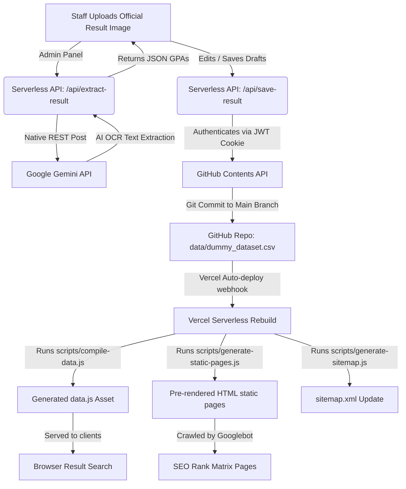

# Configurable University Results Portal

**This project demonstrates how to build a scalable university results portal using a zero-cost architecture powered by static assets, serverless APIs, OCR integration, GitHub-backed storage, and advanced SEO techniques. All datasets included in this repository are completely synthetic and generated solely for demonstration purposes.**

---

### Badge Section

[](LICENSE)
[](https://developer.mozilla.org/en-US/docs/Web/JavaScript)
[](https://vercel.com)
[](https://vercel.com/docs/functions)
[](https://ai.google.dev/)
[](data/dummy_dataset.csv)
[](#)

---

## Executive Summary & Tech Stack

This portal provides students with immediate GPA search, batch rankings leaderboards, and grade calculations. Staff and coordinators can upload official result announcements as image scans; a serverless backend leverages the **Google Gemini API** via native HTTPS calls to run OCR, extract scores, merge changes directly into a GitHub-backed CSV dataset, and trigger automatic static re-generation deployments.

### Technologies
- **Core Frontend:** HTML5, Vanilla CSS, and modular Vanilla JavaScript.
- **Serverless API Engine:** Node.js serverless functions running on Vercel.
- **AI OCR Processing:** Google Gemini API REST interface (zero-dependency, native HTTP requests).
- **Persistent Storage:** Flatfile CSV database synchronized directly through the GitHub repository API.
- **Build Pre-rendering:** Automated build scripts for sitemap and static SEO pages generation.

---

## Architecture Diagram



---

## Features

- **✓ OCR Result Parsing:** Automatic image scanning via Gemini API to extract tabular data (roll numbers and GPAs).
- **✓ GPA Search:** Instant client-side roll number lookups with complete historical semester breakdowns.
- **✓ Batch Standings & Rankings:** Complete interactive leaderboards sorted by CGPA with high-performer tiers.
- **✓ Advanced SEO Optimization:** Build-time pre-rendered pages, JSON-LD schema graphs, meta descriptions, and sitemap updates.
- **✓ Admin Dashboard & Coordinator RBAC:** Authenticated admin panels. Coordinators have department-restricted access, enforced using serverless-issued JWT cookies.
- **✓ Dynamic Branding Engine:** Centrally controlled configuration file `config/university.json` compiles titles, logos, URLs, and authorship signals at build time.
- **✓ Zero-Cost Architecture:** Designed to fit entirely on Vercel's free tier, utilizing Git commits as the state store.

---

## Screenshots Placeholder

*Below are structural outlines of the responsive portal interface:*

### 1. Homepage & Student GPA Lookup
- Clean search canvas with light/dark theme toggle, search bar for student roll numbers, and a batch selector.
- Dynamically queries client-side search indexing to display semester matrices and rank positions.

### 2. Administrative Ingestion Dashboard (`/admin`)
- Glassmorphism authentication console featuring coordinator checkboxes and security locks.
- OCR result extraction sidebar allowing side-by-side verification of original result cards with parsed JSON.

### 3. Departmental Hub & Batch Leaderboard (`/ranking/*`)
- Fully populated table showing students ranked by CGPA, semester breakdowns, grades, and top student medals.

---

## Local Setup & Installation

### Prerequisites
- [Node.js](https://nodejs.org/) (v16 or higher)
- Optional: [Python 3](https://www.python.org/) (for running local OCR service mocks)

### Setup Steps

1. **Clone the repository:**
   ```bash
   git clone https://github.com/your-username/results-portal.git
   cd results-portal
   ```

2. **Install dependencies:**
   ```bash
   npm install
   ```

3. **Configure branding properties:**
   Open `config/university.json` and customize your configuration parameters:
   ```json
   {
     "UNIVERSITY_NAME": "Your University Name",
     "UNIVERSITY_SHORT_NAME": "SHORT-NAME",
     "SITE_TITLE": "Results Portal",
     "SITE_URL": "http://localhost:3000",
     "DATASET_NAME": "dummy_dataset.csv"
   }
   ```

4. **Setup environment variables:**
   Copy `.env.example` to `.env`:
   ```bash
   cp .env.example .env
   ```
   Fill in your Gemini API Key, GitHub personal token, and JWT secret. For offline/local mock mode, use `mock` for `GITHUB_TOKEN` and `COORDINATORS_GIST_ID`.

5. **Run template compilation & data build:**
   ```bash
   npm run build
   ```

6. **Start local development server:**
   ```bash
   npm run dev
   ```
   Open `http://localhost:3000` in your browser. The administrative panel is available at `http://localhost:3000/admin` (passcode is generated in terminal output if none is provided in `.env`).

---

## Deployment to Vercel

1. **Connect Repository:** Push your code to GitHub and connect the repository in the Vercel Dashboard.
2. **Add Environment Variables:**
   Add the following environment variables in the project settings:
   - `JWT_SECRET`: Random secure string.
   - `ADMIN_PASSWORD_HASH`: Bcrypt hashed password for the administrative account.
   - `GEMINI_API_KEY`: Google Gemini API access token.
   - `GITHUB_TOKEN`: GitHub personal access token with content write permissions.
   - `COORDINATORS_GIST_ID`: Gist ID storing coordinator access credentials.
3. **Build Commands:** Configure the build command as `npm run build` and output directory as `.`.
